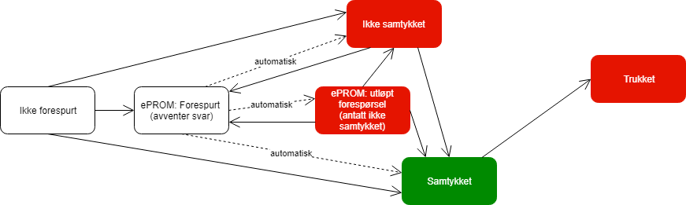

# Forskningsobjekter

Et skjema må registreres på et forskningsobjekt. Forskningsobjektene er kategorisert i typer. Som standard tilbyr eFORSK typen "Folkeregisteret" som gir personer fra folkeregisteret. I tillegg kan registre legge til sine egne typer, for eksempel legemidler, avdelinger, anonyme personer osv. På disse egenlagde typene må hvert forskningsobjekt registreres med en unik ID og et navn.

Når man lager en skjematype må man velge hvilken forskningsobjekttype som skjemaet er koblet til. Dette kan ikke endres i ettertid. Alle underskjema av skjematypen er låst til samme forskningsobjekttypen som hovedskjemaet.

Merk at kun skjematyper med forskningsobjekttypen "Folkeregisteret" kan kobles mot ePROM.

## Samtykkehåndtering

Gjelder kun for forskningsobjekt: personer fra folkeregisteret.

Samtykket tilhører personen i registeret. Informasjonen ligger globalt, og gjelder alle skjema registrert på personen uansett tilgangsenhet. Samtykket er altså det samme på tvers av alle tilgangsenheter, og alle enheter kan oppdatere samtykket. 

Konfigurasjon av registeret bestemmer hva som er personens standard samtykke-nivå ved opprettelse. 

### Samtykkenivåer

* **0. Ikke forespurt** - Grunntilstand
* **1. Forespurt (ePROM)** - Avventer svar. Kan løpe ut på tid, går da til nivå 2.
* **2. Forespørsel utløpt (ePROM)** - Antatt ikke samtykket
* **3. Ikke samtykket** - Man kan ikke registrere skjema på forskningsobjektet
* **4. Trukket** - Dette nivået kan man ikke gå bort i fra, samtykke kan ikke forsøke innhentes på nytt.
* **5. Samtykket** - Eneste nivå som tillater opprettelse av skjema.

Ved setting av 5. samtykket må man oppgi samtykkedato.
Samtykkenivået lagres med en dato for når det sist var endret og hvem som endre det. Endringer loggføres.

Når det ikke foreligger samtykket for et forskningsobjekt, vil dens skjemaer slettes bort for godt etter mellom X til X dager.

Ved trekking av samtykke (setting av status 5.) vil forskningsobjektets eventuelle skjema forsvinne umiddelbart fra grensesnittet. Det vil ta minimum et døgn før skjemaene før status slettet i databasen. Videre vil det ta minimum en uke før forskningsobjektets skjemadata blir slettet. 

### Samtykkekonfigurasjon

Hvert register kan konfigureres til å bruke en av følgende samtykkekonfigurasjoner:

* **A.** samtykke settes med spørsmål til brukeren i registeret eller etterspørres automatisk ved bestilling av ePROM - bruker må velge samtykkenivå ved opprettelse av første skjema på personen om dette allerede ikke er gjort. Det er mulighet for å gå inn på personen og gi/endre samtykke når som helst. Det er ikke mulig å opprette skjema på forskningsobjektet før samtykkenivå er **5**.
* **B.** samtykke håndteres utenfor registeret - man får da ikke spørsmål om samtykke ved registrering i registeret. Samtykkenivå for forskningsobjektet blir satt til nivå **5** ved opprettelse av skjema. Samtykke kan manuelt endres på forskningsobjektet, men kan ikke bestilles via ePROM.
* **C.** ikke aktuelt, hjemlet et annet sted

I tilfelle B eller C må administrator oppgi grunn til at samtykke håndteres utenfor registeret.

### Samtykke bestilling ePROM

Ved bestilling av ePROM vil eFORSK bestille et skjema som etterspør samtykke i tilfelle forskningsobjektet ikke har samtykke

### *Innsyn* (ikke implementert i første fase)

Via innsynsløsningen kan man velge å få sine data slettet. Dette setter samtykkenivået på til 4. som vil slette eksisterende data.
Todo
